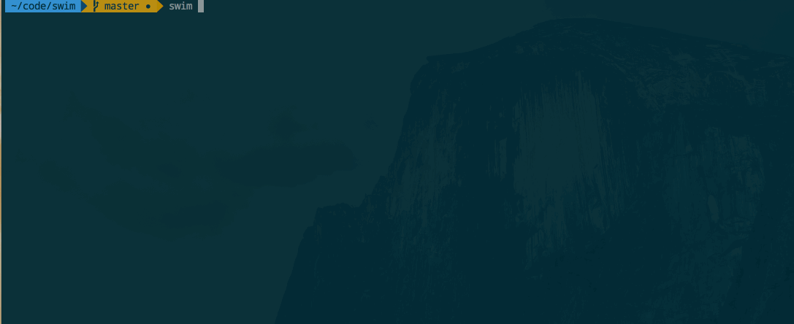

<p align="center">
  
  <br>
  <br>
  <p align = "center">
    <b>sw</b>itch v<b>im</b>rc files
  </p>
</p>

<br>
##Demo


<br>
##Install
Backup your files **before** swimming

```shell
curl -s https://raw.githubusercontent.com/dawsonbotsford/swim/master/install | bash
```


<br>
##Examples
```shell
  swim add ~/dotfiles/myVimrc favorite    #Add new swim alias
  swim ls                                 #Show available swim aliases
  swim add https://raw.githubusercontent.com/dawsonbotsford/swim/master/exampleVimrcs/vimrcWikia.vim example
  swim with favorite         #Set alias favorite as primary .vimrc
  swim with main             #Set alias main as primary .vimrc

```

<br>
##Update
```shell
swim update       #Update to the newest version of swim
```

<br>
##Available Commands
```shell
swim add <URLToRaw or pathToFile>  <alias>   #Add a swim alias
swim with <alias>                            #Change active vimrc file
swim ls                                      #List aliased vimrc files
swim active                                  #Show currently aliased vimrc
swim vim <alias>                             #Edit the vimrc stored at alias

swim mv <alias1> <alias2>                    #Rename alias (like Linux mv)
swim rm <alias>                              #Delete an alias entirely
swim update                                  #Download newest version
swim version                                 #Print version
swim help                                    #Print this message
```

<br>
##FAQ
* Where does swim store my vimrc files?
  * swim stores your vimrc files in ```~/.swim```. You can edit the vimrc files with ```swim vim <alias>``` or edit them manually from their file location.

<br>
* Does swim support emacs?
  * Not yet, it may come in the future though (it may be an install option on version 2.0.0 seeing as it would likely break backwards compatability)

<br>
####Requirements
* node.js and npm

<br>
##Changelog
* **1.0.0**: Initial Launch
* **Prelaunch**: Beta Testing

<br>
##License
MIT
